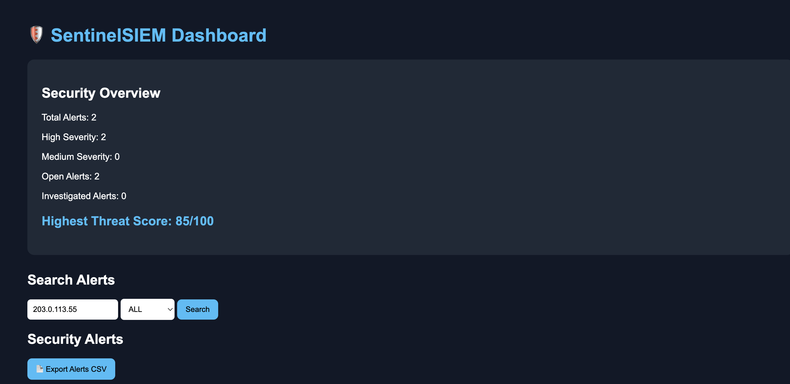
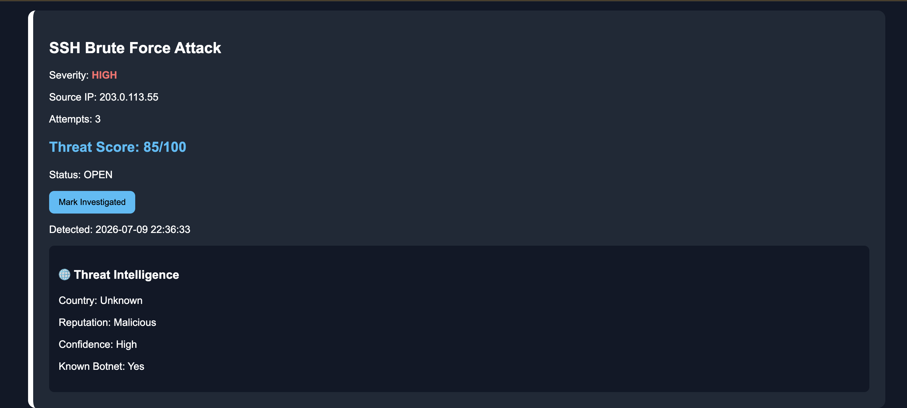
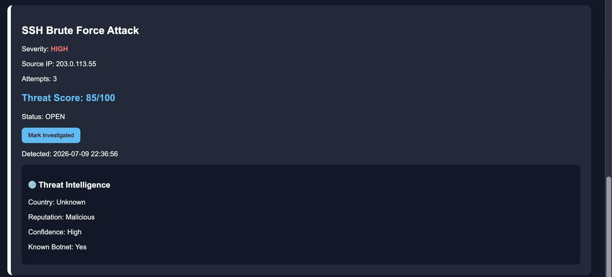
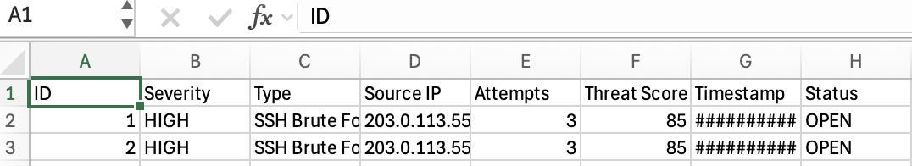

# 🛡️ SentinelSIEM

SentinelSIEM is a Python-based Security Information and Event Management (SIEM) application designed to detect, store, and visualize security events. It analyzes security logs, identifies suspicious activity, enriches alerts with threat intelligence, stores findings in a SQLite database, and presents them through a Flask web dashboard.

This project was built as a cybersecurity portfolio project to demonstrate practical skills in Python development, log analysis, threat detection, databases, web development, and security monitoring.

---

## Features

* 🔍 Analyze security log files
* 🚨 Detect brute force attacks
* 🔐 Detect SSH brute force attacks
* 🌍 Detect suspicious external logins
* ⚠️ Detect privilege escalation attempts
* 🧠 Threat intelligence enrichment
* 💾 Store alerts in SQLite
* 📊 Flask-based security dashboard
* 🔎 Search alerts by IP address
* 🎯 Filter alerts by severity
* ✅ Mark alerts as investigated
* 📄 Export alerts to CSV

---

## Technologies Used

* Python 3
* Flask
* SQLite
* HTML / CSS
* Jinja2
* Git & GitHub

---

## Project Structure

```text
SentinelSIEM/
│
├── analyzer.py              # Log analysis engine
├── app.py                   # Flask dashboard
├── database.py              # SQLite database functions
├── threatintel.py           # Threat intelligence lookup
├── sample.log               # Sample Windows-style log
├── linux_auth.log           # Sample Linux SSH log
├── alerts.json              # JSON alert output
├── sentinelsiem.db          # SQLite database
├── ARCHITECTURE.md          # System architecture
├── requirements.txt
└── README.md
```

---

## How It Works

1. Read security log files.
2. Detect suspicious activity.
3. Enrich alerts with threat intelligence.
4. Store alerts in SQLite.
5. Display alerts in the Flask dashboard.
6. Allow analysts to search, filter, investigate, and export alerts.

---

## Installation

Clone the repository:

```bash
git clone https://github.com/Codes-By-Avi/SentinelSIEM.git
cd SentinelSIEM
```

Install dependencies:

```bash
pip install -r requirements.txt
```

Run the analyzer:

```bash
python3 analyzer.py
```

Start the dashboard:

```bash
python3 app.py
```

Open your browser:

```text
http://127.0.0.1:5000
```

---

## Screenshots

### Dashboard Overview



### Search & Filtering



### Threat Intelligence



### CSV Export



---

## Future Improvements

* Real-time log monitoring
* Live threat intelligence APIs
* Email alerting
* User authentication
* Interactive charts and analytics
* Docker deployment

---

## License

This project is provided for educational and portfolio purposes.
